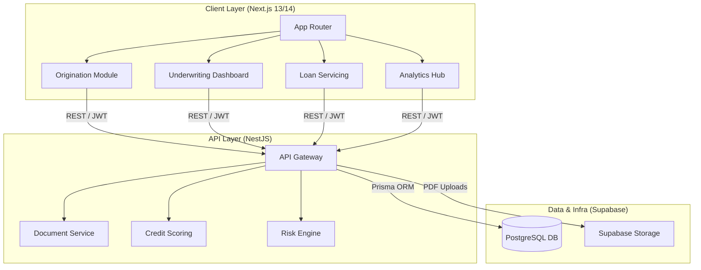
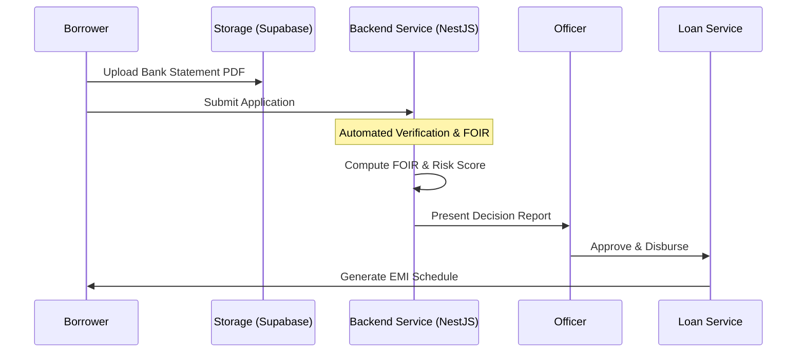

# 🏛️ IntelliLend — Modular Lending Platform

<div align="center">

**State-of-the-art end-to-end loan lifecycle management with adaptive UI and automated loan logic.**

[](https://nextjs.org)
[](https://typescriptlang.org)
[](https://turbo.build)
[](LICENSE)

[Overview](#-overview) • [Architecture](#-architecture) • [Data Flow](#-data-flow--loan-lifecycle) • [Deployment](#-hosting--deployment)

</div>

---

## ✨ Overview

IntelliLend is a full-stack fintech platform designed to automate the entire lending lifecycle. It provides an institutional-grade infrastructure for analyzing document integrity, creditworthiness, and risk.

### Key Features:
- **Comprehensive Underwriting**: Structured analysis of document integrity and creditworthiness.
- **Adaptive Lifecycle UI**: The entire dashboard theme shifts (Green → Indigo → Teal → Purple) based on the loan's current stage.
- **FOIR-First Decisioning**: Built-in deterministic calculation of Fixed Obligations-to-Income Ratio, aligned with industry standards.
- **Institutional Analytics**: Real-time portfolio KPIs, NPA trends, and conversion funnels.

---

## 🏗️ Architecture

IntelliLend is built as a **Modular Monolith** within a Turborepo, optimized for deployment on serverless infrastructure.



---

## 🔄 Data Flow — Loan Lifecycle



---

## 💰 Database Schema (Prisma)

The system manages 8 core entities to track the full lifecycle:

```prisma
model LoanApplication {
  id                String       @id @default(cuid())
  applicationNumber String       @unique
  applicantId       String
  loanType          LoanType
  requestedAmount   Decimal      @db.Decimal(14, 2)
  foir              Decimal?     // Fixed Obligation to Income Ratio
  status            LoanStatus   @default(DRAFT)
  documents         Document[]
}

model Loan {
  id                String       @id @default(cuid())
  loanNumber        String       @unique
  principalAmount   Decimal      @db.Decimal(14, 2)
  outstandingBalance Decimal     @db.Decimal(14, 2)
  emiSchedule       EMISchedule[]
}
```

---

## 🚀 Hosting & Deployment

IntelliLend is designed for high availability on free-tier infrastructure.

### Recommended Stack:
1.  **Frontend**: [Vercel](https://vercel.com) — Best-in-class support for Next.js.
2.  **API Backend**: [Render](https://render.com) — Reliable Node.js hosting.
3.  **Database & Auth**: [Supabase](https://supabase.com) — Managed Postgres + JWT.

### Deployment Steps:
```bash
# Frontend (Vercel)
vercel --prod

# Backend (Render)
# Connect repo to Render.com
# Build: pnpm install && pnpm build
# Start: pnpm start:prod
```

---

## 🗺️ Roadmap

- [x] **Phase 0**: Monorepo Scaffold & Design System
- [x] **Phase 1**: API Core & Database Schema Initialization
- [ ] **Phase 2**: Application Module & PDF Uploads
- [ ] **Phase 3**: Automated Underwriting Logic
- [ ] **Phase 4**: Real-time Risk Dashboard
- [ ] **Future**: AI-Powered Multi-Agent Pipeline

---

## 🛠️ Development

```bash
# Clone
git clone https://github.com/johnneo16/intellilend.git

# Setup
pnpm install
cp apps/web/.env.example apps/web/.env.local

# Run
pnpm dev
```

---

## 📄 License
MIT License.
